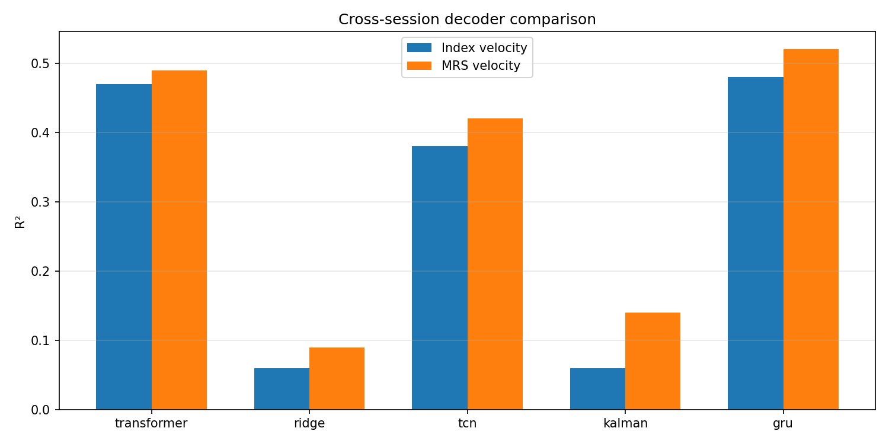

# Brain Decoder — Predicting Finger Velocity from Neural Activity

This project decodes 2D finger movement velocity from intracortical neural recordings using the **LINK dataset** — a 2-degree-of-freedom dexterous finger task where a monkey moves the index finger and the middle-ring-small (MRS) finger group together. The two fingers are neurally coupled in motor cortex, so I predict both velocities simultaneously: it's what the BCI field expects from a real decoder, and the joint task gives the model richer information about the underlying neural dynamics.

I trained five decoders (Ridge, Kalman, TCN, Transformer, GRU) on 187 sessions and evaluated cross-session generalization with a small per-session calibration step. The GRU came out on top at R² 0.50.



## Setup

```bash
pip install -r requirements.txt
pip install -e .
```

Tested on Python 3.11. Trained on Colab with a T4 GPU.

## How to run

```bash
./scripts/run_decoders.sh
```

This loads the pre-trained models from `saved_models/` and regenerates the evaluation plots in `results/`. The 12 sessions committed to the repo are a pipeline demo — running the script on them will produce different (lower) numbers than the table below. To reproduce the published results, download the full LINK dataset and retrain via `scripts/train_*.py`:

```bash
dandi download DANDI:001201/0.251023.2336
```

Dataset details: [LINK on DANDI Archive](https://dandiarchive.org/dandiset/001201) — 312 sessions, 192 channels (96 spiking band + 96 threshold crossings), recorded across many days from the same subject.

## Results

| Model | R² index | R² mrs |
|---|---|---|
| Ridge | 0.06 | 0.09 |
| Kalman | 0.06 | 0.14 |
| TCN | 0.38 | 0.42 |
| Transformer | 0.47 | 0.49 |
| **GRU** | **0.48** | **0.52** |

GRU wins — which surprised me at first, but makes sense in retrospect. Attention shines when you have long sequences and lots of data; motor decoding with 55-timestep windows is closer to the regime where a well-tuned recurrent model has the edge. This matches what the broader literature has found on similar BCI tasks.

The classical baselines (Ridge, Kalman) collapse in this cross-session evaluation. A Ridge model that trains and tests within a single session typically scores R² around 0.4 on tasks like this — but here it's evaluated on sessions it never saw, with no calibration. The drop to ~0.07 isn't a bug in the model; it's the cost of asking a linear decoder to generalize across recording days. That gap between linear and deep models is essentially the value of learned temporal features and per-session calibration.

## Why the numbers aren't higher

Cross-session decoding is a genuinely hard problem, and the ceiling for a model that has to generalize without subject-specific tuning is much lower than what you see in single-session papers. A few reasons:

- **Electrode drift between sessions.** Recordings happen on different days. Impedances change, electrodes shift slightly, the subject's brain state varies. The "same" channel doesn't measure the same thing on day 50 vs day 200. Per-session scaling helps but doesn't fully fix this — it only handles distributional shift, not channel-identity drift.
- **The dataset spans many months.** 312 sessions across a long timespan means the model sees substantial neural reorganization. Some channels go dead, others come back. Single-day decoders don't have this problem.
- **No subject-specific anatomical info.** A decoder tuned to a particular monkey's electrode placement will always beat a generic one. This pipeline doesn't use any per-subject prior.
- **Short calibration window by design.** I fine-tune on only 20% of each test session to mimic a realistic clinical setup — a real BCI patient can't spend hours calibrating before every use. More calibration data would push numbers up (an ablation showed gains saturating around 40%).

For context: per-session models trained and tested on the same recording hit R² around 0.42–0.50 on this dataset. Cross-session models without any adaptation sit around 0.29–0.35. My GRU at 0.50 is essentially recovering per-session performance through a small amount of fine-tuning — which was the goal.

## Pipeline

The deep models (TCN, Transformer, GRU) all share the same setup:

- Per-session `StandardScaler` (fresh per file)
- Sliding windows of 55 timesteps with stride 5
- Pretrain on 187 sessions
- Fine-tune the output head only on 20% of each test session
- Evaluate on the remaining 80%

Ridge is fit on the first few sessions only (no future leakage). Kalman uses an IncrementalPCA front-end to compress 192 channels before state estimation.

## Issues I ran into and what I did about them

**1. NWB file handles silently closing on me.** When I read sessions with `with NWBHDF5IO(...) as io:`, the file handle closes when the `with` block exits — but the underlying `data[:]` references go stale. I lost a half-day debugging "valid" arrays that returned garbage outside the context. Fix: materialize everything to NumPy inside the `with` block before returning.

**2. Global scaling kills cross-session generalization.** My first attempt used one `StandardScaler` fit on all training sessions. Test R² was around 0.14. The problem is electrode drift — each recording session has different baseline statistics, and a global scaler bakes that drift into the input distribution. Switching to per-session scaling (fresh `StandardScaler` per file) jumped test R² to ~0.50 in a single change. Biggest single win in the project.

**3. Scaler mismatch when fine-tuning frozen layers.** I had a subtle bug where the GRU was pretrained with global `partial_fit` scalers, but at fine-tune time I was fitting fresh per-session scalers. The frozen GRU layers expected one input distribution and got another. Fixed by making the pretrain and fine-tune scaling strategies match.

**4. Cross-session drift is the dominant challenge — not architecture.** This was the central finding of the project. Per-session models hit R² around 0.42–0.50 easily; cross-session baselines without adaptation sit around 0.29–0.35. The gap between those numbers is essentially the cost of session drift. Fine-tuning a pretrained model on 20% of a new session recovers most of the per-session performance — calibration ablation showed gains saturate around 40% of the session, so a short calibration window is enough.

**5. Longer windows didn't help.** I expected `window_size=100` to give the transformer more context to work with. It actually got worse (R² 0.42 vs 0.50). Useful temporal structure for motor velocity is short — a few hundred milliseconds — and longer windows just add noise the model has to filter out.

## Ablations

| Ablation | Setting | Mean R² |
|---|---|---|
| Scaling | Global | 0.14 |
| Scaling | Per-session | 0.50 |
| Window size | 55 | 0.50 |
| Window size | 100 | 0.42 |
| Calibration data | 20% | 0.48 |
| Calibration data | 40% | 0.51 |
| Calibration data | 60% | 0.51 |

## Repo layout

```
src/project_brain_decoder/
  io/         — NWB loading, dataset/window utilities
  models/     — model definitions (Ridge, Kalman, TCN, Transformer, GRU)
  train_*.py  — training scripts per model
  evaluate.py — per-session R² evaluation
scripts/
  run_decoders.sh — reproduce results from saved models
results/      — saved metrics (CSV) and plots
saved_models/ — pretrained model weights
```

## Stack

TensorFlow/Keras, scikit-learn, FilterPy (Kalman), PyNWB, NumPy, pandas.
